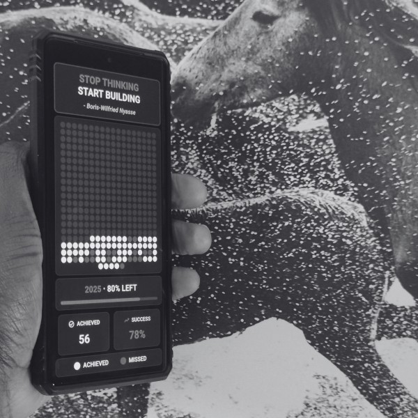

# Year Visualizer: Build, Don't Think

A simple yet powerful app that visualizes your building progress throughout the year. Each dot represents a day - white dots show days of achievement, blue dots indicate missed targets, and gray dots represent future opportunities.

## Inspiration

This app was created to address a common challenge among software professionals: the tendency to consume information without creating anything tangible. By visualizing building progress as dots, it provides a clear reminder of how we're spending our time and encourages consistent creation.

## Features

- Visual representation of all 365 days of the year
- Track days spent building vs. days missed
- See your success rate at a glance
- Progress bar showing remaining time in the year
- Clean, minimalist interface with dark theme

## Usage

The app is designed to be simple and straightforward:
1. Each day, reflect on whether you created something tangible
2. The app will display your progress visually with white dots (achieved) and blue dots (missed)
3. Use the visual reminder to stay motivated and accountable

## Configuration

The app uses a JSON file to track your progress. You can customize it by editing the `days_data.json` file in the assets folder.

## Building the App

This is a Flutter application. To build it:

1. Make sure you have Flutter installed
2. Clone this repository
3. Run `flutter pub get` to install dependencies
4. Run `flutter build` for your target platform

## Philosophy

Stop thinking, start building. In a world where technology is rapidly evolving, consistent creation is key to growth. This app serves as a daily reminder that execution matters more than endless consumption of information.

Your dots are precious - make them count.