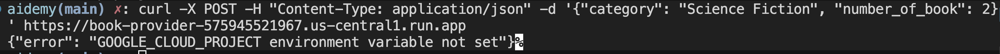
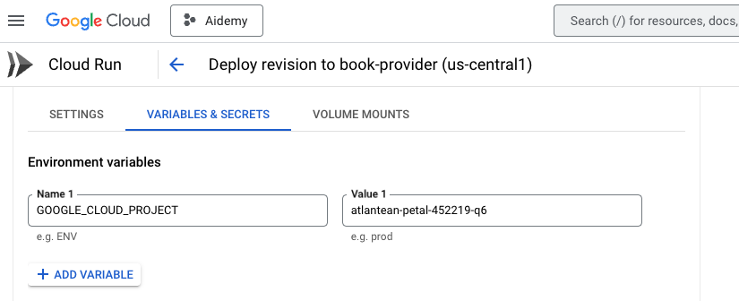

# step 4 : Building the first agent 

## google-genai==1.0.0 in requirements.txt 

Not necessary and can be misleading since we are using 
langchain_google_vertexai. 

## Potential errors :

- **GOOGLE_CLOUD_PROJECT environment variable not set**

- **How I fixed that** 

# step 5 : Building Tools : Conecting Agents to Restful Service and Data

## Feedbacks on the ToolNode : 

Actually the `recommend_book` in book.py is doing 2 things : 

- Simple call to Gemini to get the category 
- Before calling the Restful Service Book-provider 

The call to get the category must be maybe clearly illustrate in the diagram. 
Because, we could assume that we just want the tool to call the Restful service

Also, the implementation on how to interact with VertexAI to generate the category 
could be the same as the one done in the book-provider. Otherwise, it looks like we are trying to do different things.  This would give you consistency across both parts of your system and eliminate the need for that region selection logic.

## Rate Limits problems related to the way of calling the book-provider

 Instead of making multiple separate calls to Vertex AI (which increases the chance of hitting rate limits), we can modify the implementation to make a single API call requesting multiple book recommendations at once.

 I guess it is why she add the workaround get_regions ...

## Curriculums.py

- Your init_connection_pool() function has a return followed by unreachable

# step 7. Orchestrating with LangGraph

- Termination Condition: There's no clear condition for when the agent should stop calling tools and generate the final teaching plan

- This command is not with the good order. PROJECT_ID must come before BOOK_PROVIDER_URL

    export BOOK_PROVIDER_URL=$(gcloud run services describe book-provider --region=us-central1 --project=$PROJECT_ID --format="value(status.url)")
    export PROJECT_ID=$(gcloud config get project)
    export INSTANCE_NAME="aidemy"
    export REGION="us-central1"
    export DB_USER="postgres"
    export DB_PASS="1234qwer"
    export DB_NAME="aidemy-db"

Maybe just like this

    export PROJECT_ID=$(gcloud config get project)
    export INSTANCE_NAME="aidemy"
    export REGION="us-central1"
    export DB_USER="postgres"
    export DB_PASS="1234qwer"
    export DB_NAME="aidemy-db"
    export BOOK_PROVIDER_URL=$(gcloud run services describe book-provider --region=$REGION --project=$PROJECT_ID --format="value(status.url)")

- Something facing this error :

    WARNING:langchain_core.language_models.llms:Retrying langchain_google_vertexai.chat_models._completion_with_retry.<locals>._completion_with_retry_inner in 4.0 seconds as it raised ResourceExhausted: 429 Resource exhausted. Please try again later. Please refer to https://cloud.google.com/vertex-ai/generative-ai/docs/error-code-429 for more details..
    WARNING:langchain_core.language_models.llms:Retrying langchain_google_vertexai.chat_models._completion_with_retry.<locals>._completion_with_retry_inner in 4.0 seconds as it raised ResourceExhausted: 429 Resource exhausted. Please try again later. Please refer to https://cloud.google.com/vertex-ai/generative-ai/docs/error-code-429 for more details..

- This is because the workshop's billing account has some quota limits in place. I was hitting that too much , I have implemented this one :

    def get_llm(project_id):
        """Creates and returns the LLM instance with proper project configuration."""
        
        # Add a small random delay to help avoid rate limits
        time.sleep(random.uniform(2.0, 3.0))   
        
        return ChatVertexAI(
            model_name="gemini-2.0-flash-001", 
            project=project_id,
            convert_system_message_to_human=True,
            temperature=0.2,  # Lower temperature for more consistent results
            max_output_tokens=1024,  # Control token usage  
        )